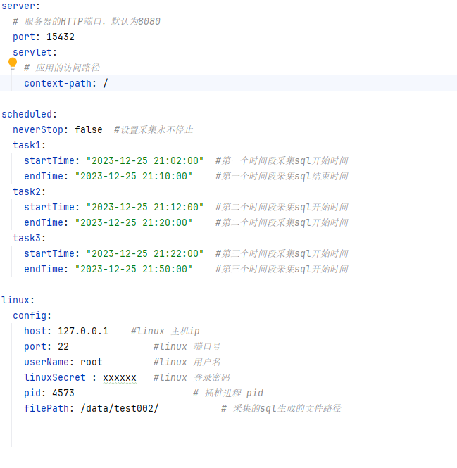

### Platform Introduction

* Dynamic instrumentation is a technique for modifying bytecode at runtime, allowing developers to intercept, modify, and monitor code during program execution. It is an efficient way to enhance and debug applications without modifying the source code.
* The main principle of dynamic instrumentation is to read, modify and generate bytecode instructions by using Java bytecode manipulation libraries (such as ASM, Byte Buddy, etc.). During the application run, these tools can insert custom bytecode instructions in specific code segments to implement code interception, modification or monitoring functions.
* The application scenarios of dynamic instrumentation include but are not limited to the following aspects:
* Performance analysis and optimization: By inserting timing and statistics instructions in key code segments, performance analysis and optimization of code can be achieved. Developers can measure code execution time, method calls, etc., and perform performance optimization.
* Logging and tracing: By inserting logging instructions, you can record application runtime information such as method calls, parameter values, return values, etc. This facilitates troubleshooting, debugging, and log analysis.
* Security Monitoring: By inserting security check instructions, monitoring and control of sensitive data, privileged access, etc. can be achieved. This helps prevent malicious code execution and data leakage.
* Code coverage analysis: By inserting coverage statistics directives, you can measure test case coverage of code and help developers identify and improve test suites.
* Dynamic modification and extension: By inserting code injection instructions, the behavior of the application can be dynamically modified and extended at runtime. This helps with functions such as dynamic configuration, AOP (Aspect Oriented Programming), etc.

### usage restrictions

* JDK version 11.0.20 or above
* mysql database versions 8.0.x, 5.0.x
* The scheduled startTime must be set after the current time, otherwise it will not be able to start

### How to use

### file download
* Download sql file get request: http://localhost:7878/data/download/chrome/sql (browser page download)
* Download sql file get request: http://localhost:7878/data/download/linux/sql (download to the specified linux path, tool.jar is deployed in the linux environment)
* Download call stack file get request: http://localhost:7878/data/download/chrome/stack (browser page download)
* Download the call stack file get request: http://localhost:7878/data/download/linux/stack (download to the specified linux path, tool.jar is deployed in the linux environment)
