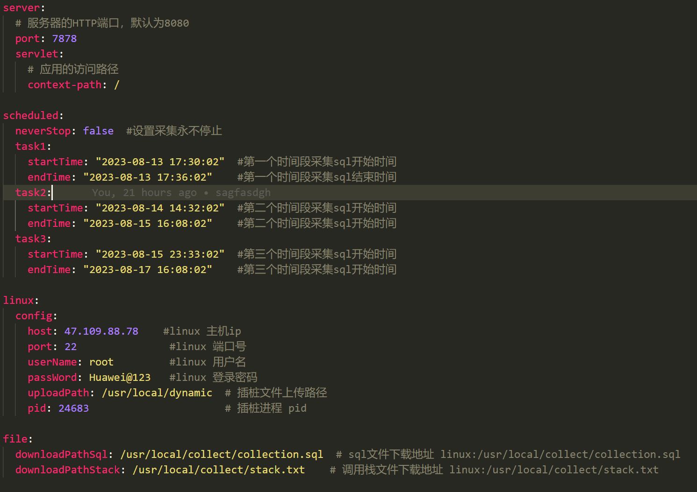

### 平台简介

* 动态插桩是一种在运行时修改字节码的技术，允许开发人员在程序执行期间对代码进行拦截、修改和监视。它是在不修改源代码的情况下对应用程序进行增强和调试的一种有效方式。
* 动态插桩的主要原理是通过使用Java的字节码操作库（如ASM、Byte
  Buddy等）来读取、修改和生成字节码指令。在应用程序运行期间，这些工具可以在特定的代码段中插入自定义的字节码指令，实现代码的拦截、修改或监视功能。
* 动态插桩的应用场景包括但不限于以下几个方面：
* 性能分析和优化：通过在关键代码段中插入计时和统计指令，可以实现对代码的性能分析和优化。开发人员可以测量代码的执行时间、方法调用次数等，并进行性能优化。
* 日志记录和追踪：通过插入日志记录指令，可以记录应用程序的运行时信息，如方法调用、参数值、返回值等。这有助于故障排查、调试和日志分析。
* 安全监控：通过插入安全检查指令，可以实现对敏感数据、权限访问等的监控和控制。这有助于防止恶意代码的执行和数据泄露。
* 代码覆盖率分析：通过插入覆盖率统计指令，可以测量测试用例对代码的覆盖率，并帮助开发人员识别和改进测试套件。
* 动态修改和扩展：通过插入代码注入指令，可以在运行时动态修改和扩展应用程序的行为。这有助于实现动态配置、AOP（面向切面编程）等功能。

### 使用限制

1. jdk版本11.0.20以上
2. mysql数据库版本8.0.x,5.0.x
3. scheduled的startTime必须设置在当前时间之后，否则会无法启动
4. conf文件下的yml信息,linux的config信息,默认用户为root用户,该用户需要有创建directory,上传文件的权限,运行启动命令的权限,否则会导致失败

### 使用方式

* 配置conf文件下的yml信息
* 自定义端口,应用访问路径(例如:/idata;/datachain;默认可以不修改)
* 启动命令:java -jar tool.jar --spring.config.name=application --spring.config.location=classpath:/application.yml,file:
* ./conf/application.yml &

### 文件下载

* 修改ip为对应服务器的ip地址,port为自定义端口号;若更改context-path,请在/data之前添加context-path路径
* 如果修改应用访问路径context-path,则需要在/data之前,端口号之后添加对应的路径
* 下载采集结果文件 get请求:http://ip:port/data/download (浏览器页面下载)
* 下载采集结果文件 curl -o sql_stack.zip http://ip:port/data/download  (服务器下载)

